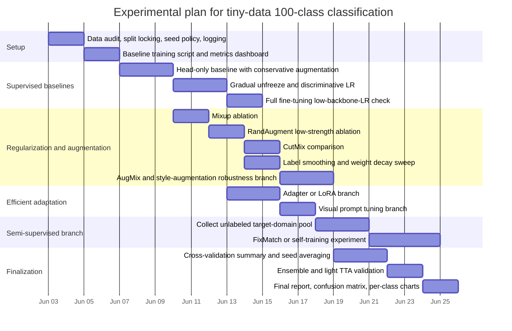

# Best Training, Augmentation, and Fine-Tuning Methods for a Tiny 100-Class Image Classification Task

## Executive summary

Your setting is unusually data-starved: the project brief is a **100-class** classification task with roughly **10 training images per class** and a strong emphasis on **transfer learning**, not training from scratch. That changes the optimal playbook. In this regime, the biggest gains usually come from **careful transfer-learning protocol, moderate but well-chosen augmentation, disciplined validation, and seed/fold averaging**—not from ever-larger training recipes or from self-supervised pretraining on the tiny labeled dataset itself. fileciteturn0file1turn0file0 citeturn53view0turn53view3turn50view0

The highest-priority recommendations are these. First, treat **head-only training, then gradual unfreezing, then full fine-tuning with low backbone LR** as your baseline ladder. This is the most stable way to exploit pretrained features while minimizing catastrophic drift on only ~1,000 total images. PyTorch’s official transfer-learning guide explicitly frames pretrained initialization and fixed-feature extraction as the standard approach for small datasets, and the project brief points in the same direction. fileciteturn0file1 citeturn53view0turn53view1turn53view2

Second, use **semantics-preserving augmentation**, but keep the strength conservative. For tiny-per-class data, augmentation is essential, but strong transforms can easily cross the line from regularization into label corruption. In practice, **crop/resize, flip only when class semantics allow it, light color jitter, and light random erasing** are usually safer starting points than aggressive shear/rotation-heavy policies. **RandAugment** is the best learned-policy family to try early because it removes the search burden of AutoAugment and exposes only a small number of knobs; **AugMix** becomes especially attractive when you expect robustness problems or deployment shift. citeturn41view0turn42view0turn42view1turn42view2turn45academia0turn45academia2turn44view1turn35academia0

Third, for regularization, **mixup is usually safer than CutMix as an early default** on extremely small datasets, because it smooths targets without physically removing localized evidence. **CutMix** can help, but it is easier to overdo when you only have a handful of exemplars per class. Both are strong tools, but they should be tuned gently here. Pair them with **label smoothing, modest weight decay, and possibly a small amount of dropout** in the classifier head. citeturn46academia0turn45academia1turn47view0turn16view5turn51academia3turn15view1

Fourth, **self-supervised and semi-supervised methods only move to the front of the queue if you have extra unlabeled images from the target domain**. DINO, SimCLR, and BYOL are powerful representation-learning methods, but SimCLR in particular is known to benefit from large batches and long training, and none of these methods are likely to be a good use of time if they are trained only on the 1,000 labeled images. By contrast, if you can gather a few thousand unlabeled images from the same domain, **DINO-style feature adaptation or FixMatch-style pseudo-labeling** can become very competitive. citeturn17academia0turn17academia1turn17academia3turn19academia0turn19academia1turn19academia2

Fifth, evaluation needs to be stricter than usual because each class has so few examples. A single random split can make weak methods look strong and vice versa. Use **stratified k-fold cross-validation**, report **mean and standard deviation across folds and seeds**, and always inspect **per-class metrics, confusion matrix, and calibration behavior**, not just one global accuracy number. PyTorch’s reproducibility notes also matter more than usual here because seed sensitivity can be large in low-data fine-tuning. citeturn34view0turn34view2turn34view3turn34view4turn50view0turn50view1turn50view3

The short version is straightforward: **do not train from scratch; do not overcomplicate the first experiments; do not trust a single split; and do not assume fancy SSL or pseudo-labeling will help unless you have extra unlabeled data from the same distribution**. fileciteturn0file1 citeturn53view0turn50view0turn19academia0turn17academia0

## Task framing and governing principles

This problem is not “regular ImageNet-style classification.” It is a **many-class, tiny-sample transfer-learning problem**. The course brief explicitly frames the task as a 100-class image classification challenge with about ten training examples per class and encourages strong use of transfer learning; it also notes that the notebook submission should make results reproducible. Those constraints matter more than almost any architectural choice. fileciteturn0file1

That leads to four governing principles.

The first principle is **bias toward pretrained features**. PyTorch’s transfer-learning tutorial states that training a whole vision model from random initialization is uncommon unless the dataset is large, and it explicitly distinguishes two canonical small-data regimes: full fine-tuning from pretrained weights and fixed-feature extraction with only the final head trained. That is directly aligned with your problem. citeturn53view0turn53view1turn53view3

The second principle is **reduce variance before chasing raw peak accuracy**. With ~10 examples per class, estimator variance is a first-order problem. Fold composition, augmentation randomness, layer freezing policy, and seed choice can move results more than small algorithmic upgrades. PyTorch’s reproducibility guide also warns that complete reproducibility is not guaranteed across platforms or releases, which means your experimental hygiene has to be deliberate. citeturn50view0turn50view1turn50view2turn50view3

The third principle is **regularize carefully, not aggressively**. Many of the strongest large-scale recipes—very strong AutoAugment-style policies, strong stochastic depth, deeply tuned schedulers—were developed in settings with far more data. In your regime, weak-to-moderate regularization usually dominates over maximal regularization, because the cost of destroying the few real class cues you have is high. That is exactly why search-free but tunable approaches like RandAugment are attractive here: they let you control regularization strength directly on the target task. citeturn45academia0turn45academia2turn48view1

The fourth principle is **separate what helps with label scarcity from what helps with domain shift**. Some augmentations, such as crop/flip/mixup, mainly fight overfitting. Others, like AugMix and style augmentation, are more about robustness to corruptions or appearance shift. Those are different objectives, and your ablations should keep them separate. citeturn44view1turn35academia0turn36academia0

## Data augmentation for tiny-per-class learning

### What to prioritize first

For this task, augmentation should be introduced in layers.

Start with a **conservative classical pipeline**. The best default stack is usually: resize/crop to the pretrained backbone’s expected size, horizontal flip only if class semantics are mirror-invariant, light color jitter, and optionally light random erasing. Torchvision documents the standard building blocks and their default operating ranges, and those defaults are a good reference point even if you ultimately narrow them for safety. citeturn41view0turn42view0turn42view1turn42view2

Then try **one stronger policy family at a time**: either mixup/CutMix or a learned policy like RandAugment. Do not stack everything immediately. With only ~1,000 samples total, overly rich augmentation compositions can create a large gap between the true data manifold and the synthetic training distribution. RandAugment was explicitly designed to avoid AutoAugment’s expensive search stage and to let augmentation strength be tailored to the target task; that is exactly the property you want on a tiny dataset. citeturn45academia0turn45academia2turn48view1

Finally, add **robustness-oriented augmentation** only if your validation error suggests a shift problem or if the test distribution is plausibly more corrupted, stylized, or illumination-shifted than the training set. AugMix improves robustness and uncertainty under corruption, and style randomization can improve domain transfer by perturbing texture, color, and contrast while preserving semantics. citeturn44view1turn35academia0turn36academia0

### Augmentation method table

| Method | Short description | Why it helps with tiny-per-class data | Practical starting range | Implementation notes | Common pitfalls | Key refs |
|---|---|---|---|---|---|---|
| RandomResizedCrop | Random crop + resize; standard classification base transform | Increases viewpoint/scale diversity without changing labels if tuned conservatively | For tiny data, start around **scale 0.6–1.0** and **ratio 0.9–1.1** rather than very wide ImageNet-style crops; widen only if objects vary strongly in scale | Torchvision default is much broader than what tiny datasets often tolerate | Too-small crops can erase the object entirely or cut away class-defining parts | citeturn41view0 |
| Horizontal flip | Random mirror transform | Doubles appearance diversity when left-right orientation is label-invariant | **p = 0.5** if orientation is safe; otherwise disable | Torchvision default is 0.5 | Dangerous for classes where sidedness, text, or asymmetry matters | citeturn42view1 |
| Color jitter | Perturb brightness/contrast/saturation/hue | Useful when overfitting to lighting/color cues is likely | Start around **0.1–0.2** for brightness/contrast/saturation and **0.02–0.05** hue | Apply before normalization; Torchvision notes hue jitter requires nonnegative image values before HSV conversion | Excessive jitter can erase subtle class cues, especially in fine-grained or medical-like categories | citeturn42view0 |
| Random erasing | Erase a rectangle region in the image | Encourages reliance on distributed evidence and improves occlusion robustness | For tiny data, try **p = 0.1–0.25** first; if helpful, move toward 0.3–0.5 | Usually apply after tensor conversion / normalization pipeline as in Torchvision examples | Easy to overdo when objects are already small; can erase the only discriminative region | citeturn42view2 |
| mixup | Convex combination of two images and labels | Strong label-space smoothing; reduces memorization and improves calibration | Start **alpha = 0.1–0.4**; if classes are very confusable, keep it toward the low end | In Torchvision it is applied on batches after the DataLoader or inside `collate_fn`; labels become soft labels | Too much mixup can underfit or blur fine-grained boundaries | citeturn46academia0turn47view0turn47view2 |
| CutMix | Cut and paste a patch from another training image; mix labels by area | Often strong regularizer and can improve robustness | Start conservatively, e.g. **alpha = 0.5–1.0** if supported; compare directly against mixup | Also a batch-level operation in Torchvision | More brittle than mixup when the object occupies a small region or when patching creates implausible images | citeturn45academia1turn47view0turn47view2 |
| AutoAugment | Search-based learned policy over image ops | Can help, but the search phase is expensive and data-hungry | Low priority here unless you reuse a published policy rather than searching your own | Torchvision ships preset policies such as ImageNet | Searching a policy on a tiny validation set can overfit the split; usually not the best use of time here | citeturn45academia2turn43view0 |
| RandAugment | Search-free learned policy with just number of ops and magnitude | Best learned-policy family to try early because it is simple and tunable on the target dataset | Try **num_ops = 1–2** and **magnitude = 4–8** first; Torchvision default is stronger at 9 | Good “strong augmentation” component for semi-supervised pipelines too | Too-large magnitude on tiny datasets often acts like label noise | citeturn45academia0turn48view0 |
| AugMix | Mixture of augmentation chains designed for robustness | Especially good when you expect corruption or domain shift | Start at or below defaults: **severity 1–3**, **mixture_width 3**, **alpha 1.0** | A robustness-oriented augmentation, not just a generic regularizer | Can add compute and may not help if your test distribution is already very clean | citeturn44view1 |
| Style augmentation | Randomize style while preserving semantic content | Helps when train-test shift is mostly in texture, color, scanner, lighting, or rendering style | Use sparingly and only if the deployment domain plausibly shifts in appearance | Best treated as a targeted robustness experiment, not a default baseline | Easy to break semantics if style transfer is too strong or poorly matched to the domain | citeturn35academia0 |

### Practical guidance on augmentation order

The best sequence to test is usually:

1. **Classical baseline**: crop/resize + optional flip + light color jitter.  
2. Add **mixup**.  
3. Replace or add **RandAugment** at low strength.  
4. Test **CutMix** against mixup, not necessarily with mixup.  
5. Add **AugMix or style augmentation** only if robustness/domain-shift evidence appears. citeturn41view0turn42view0turn45academia0turn44view1turn35academia0

That ordering matters because it lets you isolate whether gains come from generic anti-overfitting regularization or from robustness-oriented synthetic shift. citeturn45academia0turn44view1

## Semi-supervised and self-supervised methods

### The main decision rule

These methods are not all equally sensible in your exact regime.

If you **only have the ~1,000 labeled images and no extra unlabeled pool**, then training SimCLR, BYOL, or DINO yourself is usually a low-priority bet. SimCLR’s original paper emphasizes that large batch sizes and long training are especially important, and although BYOL and DINO are more forgiving, they still rely on substantial data diversity to learn rich representations. With only ten examples per class, the unlabeled objective can become another source of variance rather than a path to robust transfer. citeturn17academia0turn17academia1turn17academia3

If you **do have extra unlabeled images from the same domain**, the ranking changes sharply. In that case, DINO-style self-distillation or a FixMatch-style pseudo-labeling pipeline can be among the highest-upside additions, because they exploit abundant unlabeled target-domain structure while preserving your scarce labels for supervision. FixMatch is particularly relevant because it couples confidence-thresholded pseudo-labels from weak augmentation with a strong-augmentation consistency objective. citeturn19academia0turn19academia1turn19academia2

### Method table

| Method | Short description | Why it helps | Practical starting range | Implementation notes | Common pitfalls | Key refs |
|---|---|---|---|---|---|---|
| SimCLR | Contrastive SSL using two augmented views and negatives | Learns transferable representations without labels | Usually only worthwhile if you have substantial unlabeled data; otherwise deprioritize | Strong augmentation recipe and large batches were central in the original work | High compute demand; can underperform when data diversity and batch size are too small | citeturn17academia0 |
| BYOL | Non-contrastive SSL with online and target networks | Avoids negative pairs; often more stable than contrastive methods | Viable with unlabeled domain data; use EMA target updates and standard SSL augmentations | Good when labels are scarce but unlabeled data is available | Still needs enough image diversity; easy to spend a lot of compute for modest downstream gain | citeturn17academia3 |
| DINO | Self-distillation with no labels; especially strong with ViTs and multi-crop | Often yields strong few-shot-style features and good kNN/linear-probe behavior | Best used as target-domain unlabeled adaptation or via already-pretrained representations | Original paper emphasizes the importance of momentum teacher and multi-crop training | Training from scratch on only the labeled 1k images is usually not worth it | citeturn17academia1 |
| Pseudo-labeling | Train on model-generated labels for unlabeled data | Converts unlabeled pool into extra supervised signal | Use **high confidence threshold**, typically **0.9–0.95** as a starting rule of thumb; ramp in gradually | Best after a reasonable supervised baseline exists | Confirmation bias; wrong pseudo-labels can dominate weak classes | citeturn19academia2turn54academia2 |
| Self-training / Noisy Student | Train a teacher, label unlabeled data, train a noisier student, optionally iterate | Can improve accuracy and robustness when unlabeled data is plentiful | Start with **one teacher→student round** before adding iterations | Add noise only to the student via augmentation/dropout/stochastic depth | Large unlabeled pools help most; can be overkill for modest projects | citeturn19academia1turn51academia0turn16view5 |
| FixMatch | Weak-augmentation pseudo-labeling + strong-augmentation consistency regularization | Very strong semi-supervised baseline when labels are extremely scarce | Good starting defaults are **confidence threshold around 0.95**, strong augmentation via RandAugment, unlabeled loss weight tuned on validation | Particularly attractive if you can gather domain-matched unlabeled images | If pseudo-label confidence is miscalibrated early, model can collapse onto easy classes | citeturn19academia0turn45academia0 |

### What to try in practice

The practical ranking is simple.

If **no extra unlabeled data** exists, keep self-/semi-supervised work to the side and focus on supervised transfer-learning quality control. If **unlabeled data exists**, run **one DINO-style or FixMatch-style branch** after you already have a strong supervised baseline, not before. That keeps the extra complexity honest. citeturn17academia0turn17academia1turn19academia0

## Fine-tuning, optimization, and regularization

### Fine-tuning strategies that matter most

The official PyTorch transfer-learning tutorial lays out the two canonical anchor baselines: **fine-tune the pretrained network** or **freeze everything except the final layer**. For your task, those are not optional starting points; they are the core experimental ladder. citeturn53view0turn53view1turn53view3

A strong small-data protocol usually looks like this:

Start with **head-only training** for a short warm-start. This quickly calibrates the classifier head to the new label set while preserving pretrained features. In PyTorch’s tutorial, only the final layer is optimized in fixed-feature mode, and that pattern transfers directly to your setting. citeturn53view1turn53view2

Then move to **gradual unfreezing**. Although “gradual unfreezing” and “discriminative fine-tuning” were formalized in ULMFiT for NLP, the underlying transfer-learning logic is general: newly initialized or task-specific layers need larger updates than lower layers encoding broad reusable features. In vision, the same principle is widely used in practice as lower LR for earlier layers and higher LR for the head. This is more stable than immediately fine-tuning all weights on day one. citeturn27academia0turn53view0turn53view1

For ViT-style backbones, add **layer-wise learning-rate decay** once you unfreeze deeply. This is now a standard practical recipe in many modern fine-tuning stacks: lower layers get progressively smaller LRs than upper ones. Even though the exact “best” decay factor is backbone-dependent, a practical starting range is usually **0.65–0.9 per layer group**, with smaller values meaning more aggressive decay toward the input. This recommendation is partly a pragmatic inference from released ViT fine-tuning recipes and transfer literature, not a universal theorem. citeturn25academia0turn32academia2

### Parameter-efficient tuning for transformer backbones

If your chosen backbone is a ViT and you want to reduce trainable parameters, **adapters, LoRA, and visual prompt tuning** deserve serious attention. These are not just memory-saving tricks; in very low-data settings they can reduce overfitting by freezing most pretrained parameters. citeturn20academia0turn21academia0turn24academia0turn22view0

**Adapters** insert small bottleneck modules while freezing the backbone. AdaptFormer reports strong transfer with about 1–2% added trainable parameters, which is exactly the sort of bias you want in a tiny-data regime. A practical adapter bottleneck reduction is often **down-projection ratios around 8–64**, depending on feature dimension and compute budget. citeturn20academia0

**LoRA** injects low-rank updates into attention or projection matrices while freezing the base model. Hugging Face’s PEFT docs expose image-classification LoRA directly, and the default configuration includes **rank `r = 8`**, **`lora_alpha = 8`**, and **`lora_dropout = 0.0`**. For tiny data, a practical starting range is **r = 4–16**, **alpha = 8–32**, and **dropout = 0.0–0.1**; if overfitting appears, increase dropout before increasing rank. PEFT’s image-classification guide also notes that LoRA can use a larger LR than standard full fine-tuning because so few parameters are trained. citeturn21academia0turn22view0turn23view1turn23view2turn23view4turn23view0

**Visual Prompt Tuning** adds a small set of trainable prompt tokens to the input while freezing the ViT itself. The original VPT paper reports that it uses **less than 1%** of parameters and can outperform full fine-tuning on many downstream recognition tasks. A practical starting range is **5–20 prompt tokens**, shallow prompt tuning first, then deeper prompt insertion only if needed. citeturn24academia0

### Fine-tuning method table

| Method | Short description | Why it helps | Practical starting range | Implementation notes | Common pitfalls | Key refs |
|---|---|---|---|---|---|---|
| Head-only | Freeze backbone, train only classifier head | Lowest-variance baseline; fastest sanity check | **5–15 epochs**; LR for head often **1e-3 to 3e-3** with AdamW, or **1e-3 to 1e-2** with SGD depending on batch size | Best first experiment for every backbone | Leaves representation mismatch unresolved if domain shift is large | citeturn53view1turn53view2 |
| Full fine-tuning | Train all parameters from pretrained init | Highest ceiling when domain mismatch is meaningful | Start with low LR, often **1e-5 to 5e-4** for backbone with AdamW | Make this your third step, not your first | Easiest way to overfit or destroy pretrained features on a tiny dataset | citeturn53view3 |
| Gradual unfreeze | Unfreeze head, then top blocks, then deeper layers | Stabilizes optimization and reduces catastrophic drift | Unfreeze every **2–5 epochs** or after plateau | Often best combined with discriminative LR | Too many schedule branches can make experiments hard to compare | citeturn27academia0turn53view1 |
| Discriminative LR | Larger LR for head, smaller LR for early layers | Matches transfer-learning intuition that generic features need smaller updates | Head : upper body : lower body roughly **10 : 3 : 1** LR ratio | Easy via optimizer param groups | Ratios that are too extreme can freeze learning in lower layers | citeturn27academia0turn53view0 |
| Layer-wise LR decay | Progressively smaller LR toward earlier transformer layers | Especially helpful for deeply pretrained transformer backbones | Decay factor around **0.65–0.9** per layer group | Most useful once more than a few top layers are trainable | Backbone-specific; overtuning the decay can waste time | citeturn25academia0turn32academia2 |
| Adapters | Small trainable modules inserted into the backbone | Strong regularization through freezing most weights | Bottleneck reduction commonly **8–64** | Very attractive when compute/storage matter | May under-adapt if the target domain is very different | citeturn20academia0turn22view0 |
| LoRA | Low-rank updates to selected weight matrices | Efficient and often stable in low-data transfer | Start **r = 4–16**, **alpha = 8–32**, **dropout = 0–0.1** | Target attention/projection layers first | Wrong target-module selection can give weak adaptation | citeturn21academia0turn23view1turn23view2turn23view4 |
| Visual prompt tuning | Learn prompt tokens; keep backbone frozen | Very parameter-efficient and often competitive in few-shot transfer | Start with **5–20 prompt tokens** | Best suited to ViT-style backbones | Can underperform if prompt capacity is too small for large domain shift | citeturn24academia0 |

### Regularization and optimizer choices

**Label smoothing** is almost always worth a quick trial in many-class tiny-data classification because it reduces overconfidence and can stabilize training. A practical starting range is **0.05–0.1**. Larger values are possible, but on a 100-class problem with only 10 real examples per class, too much smoothing can wash out already-weak supervision. The classical label-smoothing reference is the Inception paper. citeturn51academia3

**Dropout** is useful mainly in the classifier head or newly added layers, not as a reflex everywhere. The PyTorch API notes the default probability is 0.5, but for fine-tuning modern pretrained vision backbones, **0.1–0.3** in the head is often the safer opening move. citeturn16view5

**Weight decay** should almost always be on. For AdamW, a practical range is **1e-4 to 5e-2**, with smaller values when only the head is being trained and moderate values once more of the backbone is unfrozen. AdamW’s core benefit is exactly what its name says: decoupled weight decay rather than conflating it with the adaptive gradient step. citeturn15view1turn13academia0

**Stochastic depth** is powerful in very deep networks, but it is not a default first-line regularizer for your project. The original paper shows its value for training extremely deep nets, but on tiny transfer-learning datasets its benefit can be inconsistent. If your backbone exposes it, keep it low: **0.0–0.1** as an ablation, not a baseline. citeturn51academia0

**AdamW** is the safest default optimizer for transformer-style full fine-tuning and PEFT setups. **SGD with momentum** remains a strong baseline, especially for CNN-style transfer, and PyTorch’s SGD docs document the canonical momentum form. In practice: use **AdamW first for transformer fine-tuning and PEFT**, and **SGD+momentum 0.9** as a reference baseline or when a CNN backbone is used. citeturn15view1turn30view0turn30view1

For schedulers, **cosine decay with warmup** is the best general default. PyTorch documents cosine annealing directly; OneCycle is also well-supported and can work well for short head-only or shallow-unfreeze runs. Practical warmup is often **5–10% of total steps** for transformer-style fine-tuning. For OneCycle, the scheduler changes LR every batch and uses parameters like **`pct_start = 0.3`**, **`div_factor = 25`**, and **`final_div_factor = 1e4`** by default in PyTorch. citeturn15view2turn16view4turn12academia2

### Regularization and optimizer table

| Method | Why it helps | Practical starting range | Notes | Pitfalls | Key refs |
|---|---|---|---|---|---|
| Label smoothing | Reduces overconfidence; can improve generalization/calibration | **0.05–0.1** | Easy drop-in with cross-entropy variants | Too much smoothing can underfit rare discriminative cues | citeturn51academia3 |
| Dropout | Adds noise regularization in new layers/head | **0.1–0.3** in head first | More useful in head than everywhere in backbone | 0.5 is often too strong for already-regularized fine-tuning | citeturn16view5 |
| Weight decay | Penalizes overfitting; especially important with AdamW | **1e-4 to 5e-2** | Decoupled in AdamW | Too much can slow adaptation and harm head-only training | citeturn15view1turn13academia0 |
| Stochastic depth | Extra regularization for deep nets | **0.0–0.1** if available | Low priority here | Can destabilize tiny-data fine-tuning if too strong | citeturn51academia0 |
| AdamW | Strong default for transformer fine-tuning / PEFT | LR often **1e-5 to 5e-4** for backbone, higher for head-only/LoRA | Pair with cosine + warmup | Can overfit quickly if LR is set too high on full backbone | citeturn15view1 |
| SGD + momentum | Strong classical transfer baseline | Momentum **0.9**; LR task-dependent | Particularly worth keeping for CNN baselines | More sensitive to LR schedule and batch size | citeturn30view0turn30view1 |
| Cosine scheduler | Smooth annealing; strong all-purpose default | Warmup **5–10%** of steps; decay to a small floor | Excellent for longer fine-tuning | If run is very short, gains over simpler schedules may be small | citeturn15view2turn12academia2 |
| OneCycle | Short-run aggressive schedule | Use PyTorch defaults as baseline; tune `max_lr` | Good for head-only or shallow-unfreeze runs | Less intuitive when many parameter groups use discriminative LR | citeturn16view4turn12academia3 |

## Validation, small-data training tricks, and reproducibility

### Validation protocol and metrics

With ten examples per class, **split strategy is part of the method**. Scikit-learn’s `StratifiedKFold` preserves class proportions across folds and defaults to five splits; in your setting, **5-fold stratified CV** is a very reasonable default because each validation fold still sees about two examples per class, which is thin but workable. Report **mean ± standard deviation** across folds, and if feasible also across **multiple seeds**. citeturn34view0turn34view1turn50view0

Accuracy alone is not enough. Use **macro F1 or macro recall**, **per-class accuracy**, **balanced accuracy if class counts drift**, and **top-k accuracy** because on a 100-class task the top-5 signal is often informative even when top-1 is noisy. Scikit-learn’s `classification_report`, `confusion_matrix`, and `top_k_accuracy_score` make that straightforward. citeturn34view2turn34view3turn34view4

The three visualizations I would treat as mandatory are: **normalized confusion matrix**, **per-class accuracy bar chart**, and **training/validation learning curves**. The confusion matrix will show whether errors are localized to a few visually similar classes; the per-class bar chart will reveal “dead classes” hidden by average accuracy; and the learning curves will tell you whether you are overfitting, under-augmenting, or setting LR too high. citeturn34view2turn34view3

### Small-data tricks that are actually worth trying

**Cross-validation ensembling** is one of the most reliable boosts in this regime. PyTorch’s ensembling tutorial defines ensembling simply as combining predictions from multiple models; for you, the practical version is averaging probabilities from separate folds, seeds, or two close-but-distinct training recipes. This often improves more reliably than a single fancy regularizer. citeturn39view0

**Test-time augmentation** is worth testing, but not assuming. The common intuition is that averaging predictions across transformed versions of the same image can improve robustness post hoc, but recent empirical work shows that TTA can also hurt when the test-time transforms do not match what the model learned during training. For this project, use **light TTA only**—for example original + horizontal flip if valid, or original + one weak crop—and keep a no-TTA baseline. citeturn37academia3turn37academia0

**Class-balanced loss** and **focal loss** are lower-priority here unless your effective training distribution becomes imbalanced after filtering, pseudo-labeling, or data collection. The original class-balanced loss paper is targeted at long-tailed distributions, and focal loss was introduced for extreme class imbalance in detection. If your supervised set is truly balanced at ~10 per class, they are ablations, not defaults. If you do try them, practical starts are **focal gamma = 1–2** and **class-balanced beta = 0.99–0.999** depending on the severity of imbalance. citeturn52academia0turn51academia1

### Reproducibility and deterministic settings

PyTorch’s reproducibility docs are unambiguous: **complete reproducibility is not guaranteed across releases, commits, devices, or CPU/GPU**, even with identical seeds. What you can do is reduce nondeterminism substantially. citeturn50view0

At minimum, set **`torch.manual_seed`**, Python `random.seed`, and NumPy `np.random.seed`; disable cuDNN benchmark mode with **`torch.backends.cudnn.benchmark = False`** when you want deterministic behavior; and enable **`torch.use_deterministic_algorithms(True)`** when possible. The docs also show how to seed DataLoader workers with `worker_init_fn` and a fixed `torch.Generator`. citeturn50view1turn50view2turn50view3

For a report-grade experiment manifest, log all of the following for every run: backbone identifier, pretrained weight source, train/val indices or CV fold definitions, image size, normalization constants, augmentation recipe, optimizer, scheduler, LR by parameter group, regularization values, number of unfrozen layers, random seed, package versions, and git commit hash. The project brief’s emphasis on reproducibility makes this especially important. fileciteturn0file1 citeturn50view0turn50view3

## Prioritized ablation plan and method comparison

### Comparison table

The table below is a synthesis of the literature and practical transfer-learning behavior in tiny-data classification. The **benefit / complexity / risk** columns are judgment calls informed by the cited sources and by how these methods typically behave when data is extremely scarce.

| Method family | Expected benefit | Complexity | Risk | Best use case | Summary judgment |
|---|---|---:|---:|---|---|
| Head-only fine-tuning | High | Low | Low | First baseline on any pretrained backbone | Mandatory starting point. citeturn53view1turn53view2 |
| Gradual unfreeze + discriminative LR | Very high | Medium | Medium | Stable transfer when domain mismatch exists | Usually the highest-value supervised upgrade. citeturn27academia0turn53view0 |
| Conservative classical augmentation | High | Low | Low | Every run | Mandatory. Tune gently. citeturn41view0turn42view0turn42view1turn42view2 |
| mixup | High | Low | Low-Medium | General anti-overfitting regularization | Best first “strong regularizer” to test. citeturn46academia0 |
| RandAugment | Medium-High | Low-Medium | Medium | Need stronger augmentation without policy search | Best learned augmentation to try early. citeturn45academia0turn48view1 |
| CutMix | Medium | Low-Medium | Medium-High | Object occupies sizable local region | Useful, but less safe than mixup here. citeturn45academia1 |
| AugMix | Medium | Medium | Low-Medium | Anticipated corruption or shift | High-value if robustness is the bottleneck. citeturn44view1 |
| Adapters / LoRA / VPT | Medium-High | Medium | Low-Medium | ViT backbone, overfitting or compute constraints | Strong options for PEFT ablations. citeturn20academia0turn21academia0turn24academia0turn23view1 |
| Full fine-tuning from the start | Medium | Low | High | Large domain mismatch and careful tuning | Usually too brittle as the first strategy. citeturn53view3 |
| DINO / BYOL / SimCLR training on only 1k labeled images | Low | High | High | Rarely justified here | Deprioritize unless you have extra unlabeled data. citeturn17academia0turn17academia1turn17academia3 |
| FixMatch / pseudo-labeling with domain-matched unlabeled pool | High | High | Medium-High | Extra unlabeled data available | Very worthwhile if unlabeled data exists. citeturn19academia0turn19academia1turn19academia2 |
| Cross-validation ensembling | Medium-High | Medium | Low | Final model selection and leaderboard push | One of the most reliable late boosts. citeturn34view0turn39view0 |
| TTA | Low-Medium | Low | Medium | Only if validated | Can help, but absolutely must be tested. citeturn37academia3turn37academia0 |

### Prioritized experiment checklist

A disciplined ablation order matters more than squeezing fifteen ideas into one run.

Start with a **reference supervised transfer pipeline**. That means: head-only baseline, conservative classical augmentation, AdamW or SGD baseline depending on backbone family, cosine or simple decay schedule, and 5-fold stratified CV. This creates the anchor for every later decision. citeturn53view1turn34view0turn15view2turn30view0

Then test **one axis at a time**:

- **Axis one: fine-tuning depth**  
  Compare head-only, gradual unfreeze, and full fine-tune with very low backbone LR. citeturn53view1turn53view3turn27academia0

- **Axis two: regularization strength**  
  Compare none vs label smoothing vs mixup vs mixup + light RandAugment. citeturn51academia3turn46academia0turn45academia0

- **Axis three: PEFT vs full updates**  
  If using a ViT, compare gradual full fine-tuning against adapters and LoRA or VPT. citeturn20academia0turn21academia0turn24academia0

- **Axis four: robustness**  
  Add AugMix or style augmentation only after the supervised baseline is stable. citeturn44view1turn35academia0

- **Axis five: data expansion**  
  Only if extra unlabeled data exists, try FixMatch or one self-training round. citeturn19academia0turn19academia1

The final stage is **variance reduction**: seed averaging, fold ensembling, and optionally carefully validated light TTA. citeturn39view0turn37academia0turn37academia3

### Suggested ablation sequence

A practical sequence that balances rigor and time is:

1. Head-only baseline with conservative classical augmentation.  
2. Same baseline + mixup.  
3. Same baseline + gradual unfreeze + discriminative LR.  
4. Replace classical augmentation with low-strength RandAugment, with and without mixup.  
5. If using a ViT: compare full fine-tune vs LoRA / adapters / VPT.  
6. Add label smoothing and tune weight decay.  
7. Add AugMix only if robustness or domain shift appears limiting.  
8. If unlabeled data exists: run FixMatch or one self-training cycle.  
9. Finalize with cross-validation ensembling and light TTA only if validated. citeturn46academia0turn45academia0turn20academia0turn21academia0turn24academia0turn44view1turn19academia0

### Mermaid timeline

This timeline is a practical execution plan for the project constraints in the brief and the methodological priorities above. fileciteturn0file1

## Open questions and limitations

A few recommendations above are intentionally presented as **practical starting ranges**, not as universally optimal constants. That is especially true for crop scale, layer-wise LR decay, and PEFT hyperparameters; those settings are known to be backbone- and domain-sensitive even when the underlying methodological principle is strong. citeturn41view0turn25academia0turn23view2

The biggest unresolved variable is whether you have access to **extra unlabeled images from the same target domain**. If the answer is yes, semi-supervised methods like FixMatch and self-training move much higher in priority. If the answer is no, they should stay off the critical path. citeturn19academia0turn19academia1turn19academia2

Finally, although deterministic settings reduce noise, PyTorch explicitly warns that **exact reproducibility across platforms and devices is not guaranteed**. For that reason, the scientifically defensible unit of comparison in this project is not “best single run,” but **mean performance across locked folds and seeds with the full recipe logged**. citeturn50view0turn50view1turn50view2turn50view3