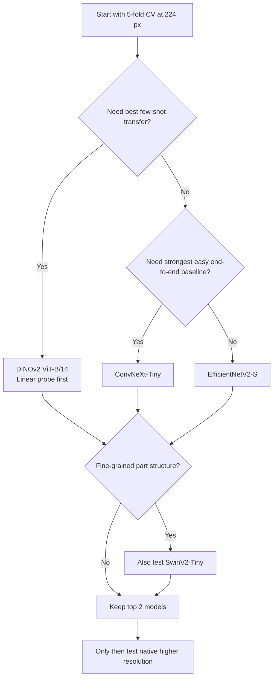

# Publicly Available Vision Models for a Tiny 100-Class Classification Project

## Executive summary

With roughly **1,000 training images total and only about 10 labeled images per class**, the decisive issue is **transfer behavior under severe label scarcity**, not who wins a full-data ImageNet leaderboard. In this regime, the best first bets are **DINOv2 ViT-B/14** as a frozen or partially unfrozen feature backbone, **ConvNeXt-Tiny** as the strongest conventional end-to-end baseline, and **EfficientNetV2-S** as the best accuracy-per-parameter sanity check. **SwinV2-Tiny** and **DeiT III-Small** are the next most credible follow-ups. **BEiT-Base** and vanilla **ViT-B/16** can be strong, but they are materially easier to overfit if you fully unfreeze too early. **MobileViT-S, CaiT, and ConvMixer** are useful as ablations or deployment-oriented options, not as first-line accuracy plays. citeturn23view3turn39view0turn40view4turn27view0turn30view6

The practical implication is straightforward: **do not start with the biggest model and full fine-tuning**. Start with **224 px**, run **5-fold stratified cross-validation**, compare a **frozen-feature baseline** against **partial fine-tuning**, and only then test native higher resolutions on your best two models. PyTorch itself warns that complete reproducibility is not guaranteed across releases, platforms, or CPU/GPU paths, and scikit-learn’s `StratifiedKFold` is explicitly designed to preserve class proportions across folds; both matter a lot when your validation set may only contain **two images per class per fold**. citeturn49view0turn49view1turn49view3turn49view4

## Why tiny data changes the ranking

In a normal “enough labels” setting, you might rank models mostly by their headline ImageNet accuracy. In your setting, that is the wrong heuristic. What matters more is whether a model can produce good decision boundaries when you only have a handful of labeled examples per class. Meta’s DINOv2 repository is unusually explicit here: it says DINOv2 features can be used with classifiers “as simple as linear layers,” are robust across domains, and often work without fine-tuning. That is exactly why DINOv2 moves to the top of the list for your project even though its canonical inference size is large. citeturn23view3

The best conventional counterweight is a strong convolutional model. ConvNeXt was designed to keep the simplicity and inductive bias of ConvNets while matching transformer-era accuracy and scalability, and ConvNeXt-Tiny gives you a strong, mature, well-supported supervised baseline without the same tendency to become brittle under extremely small labeled data. EfficientNetV2-S belongs in the same conversation: it remains one of the best public “small but serious” baselines and is especially valuable because it helps you test whether a simpler CNN is already saturating your dataset before you spend time on more delicate transformer tuning. citeturn25view3turn39view0turn27view0

Hierarchical transformers sit in the middle. SwinV2 adds cosine attention, log-spaced continuous position bias, and SimMIM-oriented scaling ideas; DeiT III improves the supervised ViT recipe substantially. Both are strong options, but in a 10-images-per-class regime they still benefit from conservative backbone learning rates and staged unfreezing. That makes them good “second wave” models after you establish your DINOv2 and ConvNeXt baselines. citeturn24view4turn30view6turn31view1

## Prioritized comparison table

| Priority | Model | One-line summary | Typical pretraining | Params / FLOPs | Canonical input | Public weights and license | Tiny-data fit | Main risk on ~10 images/class | Approx. 224 inference VRAM |
|---|---|---|---|---:|---|---|---|---|---:|
| High | **DINOv2 ViT-B/14** | Best “few labeled examples” option if used as a frozen or lightly unfrozen backbone | **LVD-142M**, self-supervised | **86.6M / 151.7G** at canonical size | **518 canonical; 224 practical start** | Official repo + HF/timm; **Apache-2.0** | **Excellent** | Full end-to-end fine-tuning can overfit; canonical resolution is expensive | **~0.31–0.57 GB** citeturn23view3turn34view0turn32view2turn22view3 |
| High | **ConvNeXt-Tiny** | Strongest straightforward end-to-end supervised baseline | **ImageNet-12k → 1k** on a practical public port; official family also has **22k → 1k** models | **28.6M / 4.5G** | **224 canonical** | Official repo + HF/timm; **MIT repo, Apache-2.0 port** | **Excellent** | Can still memorize backgrounds if augmentation is too weak | **~0.08–0.15 GB** citeturn39view0turn43view0 |
| High | **EfficientNetV2-S** | High-value CNN baseline with strong accuracy per parameter | Public practical checkpoint on **ImageNet-1k**; official family from Google’s EfficientNetV2 line | **23.9M / 4.9G** | **288 train / 384 eval canonical; 224 practical start** | Public HF/timm checkpoint; **Apache-2.0** | **Very good** | Progressive-size training and heavy augmentation can become too aggressive for tiny data | **~0.06–0.11 GB** citeturn27view0turn27view3 |
| High | **SwinV2-Tiny** | Hierarchical transformer; especially plausible for fine-grained spatial structure | **ImageNet-1k** | **28.3M / 6.0G** | **256 canonical** | Official repo + HF/timm; **MIT** | **Very good** | More optimization-sensitive than ConvNeXt at the same data size | **~0.09–0.17 GB** citeturn40view4turn30view8turn31view1 |
| High | **DeiT III-Small** | Data-efficient supervised ViT with a much better recipe than early DeiT | **ImageNet-22k → 1k** | **22.1M / 4.6G** | **224 canonical** | Official repo + HF/timm; **Apache-2.0** | **Very good** | Usually less robust than DINOv2 once labels become extremely scarce | **~0.07–0.12 GB** citeturn30view6turn31view2turn18view0 |
| Medium | **ViT-B/16** | Useful reference transformer baseline; still competitive with strong pretraining | **ImageNet-21k AugReg** | **102.6M / 16.9G** | **224 canonical; 384 often best for FT** | Official repo + HF/timm; **Apache-2.0** | **Good** | Full fine-tuning is easy to destabilize or overfit on tiny data | **~0.23–0.42 GB** citeturn29view0turn41view0turn28view2 |
| Medium | **BEiT-Base** | Masked-image-pretrained ViT; good if you treat it as a representation model first | **ImageNet-22k MIM** with dVAE tokenizer | **102.6M / 17.6G** | **224 canonical** | Official repo + HF/timm; **MIT repo, Apache-2.0 port** | **Good** | Heavier and more brittle than ConvNeXt/EfficientNet under naive full FT | **~0.25–0.44 GB** citeturn30view7turn31view0turn4view4 |
| Medium | **ResNeSt-50d** | Strong split-attention ResNet baseline; very easy to use | **ImageNet-1k** | **27.5M / 5.4G** | **224 canonical** | Official repo + HF/timm; **Apache-2.0** | **Good** | Older ceiling; often trails ConvNeXt/Swin/DeiT on absolute accuracy | **~0.08–0.15 GB** citeturn44view0 |
| Medium | **ECA-NFNet-L0** | Good NFNet-family CNN alternative if you want a non-BN backbone | Public practical checkpoint on **ImageNet-1k**; official NFNet family weights are provided for **F0–F6** | **24.1M / 4.4G** | **224 train / 288 eval canonical** | Official family repo + practical HF/timm port; **Apache-2.0 repo** | **Good** | Family/port mismatch makes it less standardized than ConvNeXt or EfficientNetV2 | **~0.07–0.12 GB** citeturn21view0turn36view0turn37view0 |
| Exploratory | **CaiT-XXS24** | Lightweight class-attention ViT; historically interesting but less compelling now | **ImageNet-1k** with distillation | **12.0M / 2.5G** | **224 canonical** | Official DeiT repo + HF/timm; **Apache-2.0** | **Mixed** | Mostly superseded by stronger, easier options like DeiT III and DINOv2 | **~0.06–0.11 GB** citeturn26view1turn18view0 |
| Exploratory | **MobileViT-S** | Best when deployment or edge inference matters | **ImageNet-1k** | **5.6M / 2.0G** | **256 canonical** | Official Apple repo + HF/timm; **Apple sample code license / other** | **Mixed** | Lower absolute accuracy ceiling than the top half of this list | **~0.04–0.07 GB** citeturn38view0turn21view7turn33view3 |
| Exploratory | **ConvMixer-768/32** | Very simple patch-CNN hybrid; good ablation, not a first choice | **ImageNet-1k** | **21.1M / 19.5G** | **224 canonical** | Original repo + HF/timm; **MIT** | **Exploratory** | Usually weaker transfer than better-supported modern ConvNeXt/DeiT/Swin backbones | **~0.09–0.17 GB** citeturn26view0 |

**Interpretation notes.** “FLOPs” above are the values reported by the cited public checkpoint/model card at the checkpoint’s canonical image size, so they are not perfectly apples-to-apples across rows. The VRAM column is a **rough batch-1 fp16 model-only estimate at 224×224**, derived from the cited parameter/activation statistics and rescaled when the checkpoint’s canonical size is larger; actual PyTorch allocation will be higher once CUDA context, kernels, and framework overhead are included.

## Model-by-model implications

The table points to three practical clusters. The **representation-first models** are DINOv2, BEiT, and to a lesser degree vanilla ViT. These are strongest when you **respect the pretraining**: start with a linear probe or last-block unfreezing, keep the backbone learning rate very low, and only move to fuller fine-tuning if cross-validation says it is helping. DINOv2 is the standout because the original release is explicitly designed around robust visual features that work well with simple heads and often transfer across domains without needing much adaptation. citeturn23view3turn30view7turn29view0

The **easy-to-fine-tune supervised backbones** are ConvNeXt-Tiny, EfficientNetV2-S, ResNeSt-50d, and ECA-NFNet-L0. These are the models you reach for when you want fewer training surprises. ConvNeXt is the strongest of this group for your setting. EfficientNetV2-S is the cleanest control experiment because it is small, fast, and still serious. ResNeSt and NFNet remain useful if you want robust CNN baselines that are not standard ResNets, but I would treat them as “prove the simpler architecture is enough” baselines rather than as likely winners. citeturn39view0turn27view0turn44view0turn36view0turn21view0

The **middle-ground transformer options** are SwinV2-Tiny and DeiT III-Small. They are stronger than the “exploratory” group and more practical than full-size ViT/BEiT under very small labels, but they still like careful scheduling and staged unfreezing. If your classes are fine-grained, rely on local part structure, or the dataset has more geometry than texture, SwinV2-Tiny deserves promotion into your first wave. If you want a supervised transformer that is more forgiving than vanilla ViT, DeiT III-Small is the right choice. citeturn40view4turn30view6turn24view4

The **exploratory / deployment-oriented options** are CaiT, MobileViT-S, and ConvMixer. None is bad, but all are harder to justify as a first serious experiment when stronger public checkpoints now exist. CaiT is historically important but largely eclipsed by later DeiT and DINO-style models. MobileViT-S is worth trying only if eventual edge deployment matters, or if you need a much smaller model. ConvMixer is useful as a “very simple architecture” ablation, but it should not be where you spend your first week. citeturn26view1turn38view0turn26view0

## Recommended starting setup

The three models I would try first are **DINOv2 ViT-B/14**, **ConvNeXt-Tiny**, and **EfficientNetV2-S**. DINOv2 comes first because your data regime is exactly where strong self-supervised representations usually pay for themselves; the official DINOv2 release explicitly emphasizes strong linear-probe behavior and cross-domain robustness. ConvNeXt-Tiny comes second because it is the best “just fine-tune it carefully” baseline on this list. EfficientNetV2-S comes third because it tells you very quickly whether a smaller, highly optimized CNN is already enough for your dataset. If your classes are visually fine-grained, substitute **SwinV2-Tiny** for EfficientNetV2-S in the first round. citeturn23view3turn39view0turn27view0turn40view4

A good recipe for your scale is not exotic. Use **5-fold `StratifiedKFold` with `shuffle=True` and a fixed `random_state`**, so each fold preserves class proportions. In your case that means each fold gives you roughly **8 training images and 2 validation images per class**, which is far better than trusting a single random 80/20 split. Report **mean ± standard deviation across folds**, and if you have the time, repeat the entire CV run with **2–3 seeds** for your top two models. citeturn49view3turn49view4

For optimization, use **AdamW** as the default optimizer. PyTorch’s implementation makes the decoupled weight-decay behavior explicit, and it is the safest common denominator across ConvNeXt, ViT-family models, Swin, and DINOv2-style fine-tuning. Use `CrossEntropyLoss(label_smoothing=0.05)`; PyTorch supports label smoothing directly, and in your setting a small amount is usually enough to reduce overconfidence without washing out already-scarce signal. citeturn49view5turn49view6

A practical staged schedule for your data size is:

| Phase | What to do | Reasonable settings for this project |
|---|---|---|
| **Cross-validation setup** | Use 5 folds and keep the fold file fixed for all models | `StratifiedKFold(n_splits=5, shuffle=True, random_state=42)`; compare **mean CV accuracy** and **std** |
| **Warm start** | Start at **224×224** for every model | Standardizes comparisons; only escalate to 256/288/384 on finalists |
| **Frozen-backbone warmup** | Train only the classifier head first | **Transformers / DINOv2 / BEiT / Swin / DeiT / CaiT:** 5–8 epochs, head LR **1e-3 to 3e-3**, WD **0.01–0.05** |
| **Partial unfreeze** | Unfreeze the last 1–2 transformer blocks or final stage(s) | Backbone LR **1e-5 to 5e-5** for transformer-style models, head LR **5e-4 to 1e-3**, cosine decay, 15–20 more epochs |
| **CNN fine-tuning** | ConvNeXt / EfficientNetV2 / ResNeSt / NFNet / MobileViT / ConvMixer | Optional 0–3 epoch frozen warmup, then full FT with backbone LR **1e-4 to 3e-4**, head LR **1e-3**, WD **0.01–0.05** |
| **Augmentation** | Keep it moderate, not maximal | Random resized crop with conservative scale, horizontal flip if semantics allow, mild color jitter, very mild MixUp (for example **0.1–0.2**) only after a no-MixUp baseline |
| **Batching** | Small but stable | Batch size **16–32** at 224, or gradient accumulation to reach similar effective batch size |
| **Stopping rule** | Do not overtrain tiny labels | Early stopping with patience **4–6 epochs** on fold validation accuracy or macro-F1 |
| **Final submission model** | Use ensembling only after CV is stable | Average logits from the **5 fold models** for the top one or two architectures |

One subtle but important point: in a 10-images-per-class regime, **aggressive augmentation is as dangerous as under-augmentation**. It is easy to destroy the few stable class cues you have. Start with mild augmentation, get a baseline, and then add only one stronger regularizer at a time. The models in this report that are most likely to reward stronger augmentation are **ConvNeXt-Tiny, EfficientNetV2-S, and DeiT III-Small**; the ones most likely to punish overly aggressive full fine-tuning are **DINOv2, ViT-B/16, and BEiT-Base**. citeturn43view0turn27view0turn30view6turn23view3turn29view0turn30view7

For reproducibility, be strict. PyTorch documents that complete reproducibility is **not guaranteed** across releases, commits, platforms, or CPU/GPU execution paths. Seed **PyTorch**, **Python**, and **NumPy**; keep `torch.backends.cudnn.benchmark = False` during experiment comparison; and use deterministic algorithms while debugging if you need exact reruns, understanding that PyTorch also warns deterministic execution can be slower. In practice, the minimum reproducibility package for your report is: exact checkpoint name, exact fold indices, exact class-to-index mapping, exact augmentation policy, exact library versions, and saved random seeds. citeturn49view0turn49view1turn49view2

## Open questions and limitations

A few things remain dataset-dependent. If your images are **far from natural-image statistics**—for example medical imaging, satellite imagery, industrial inspection, microscopy, or very stylized graphics—the ranking can shift, and a domain-aligned backbone may beat every model in this report. The list above is optimized for **mature, public, reproducible general-purpose vision checkpoints**, not for every possible specialized domain.

The **license field** is also slightly messier than it looks at first glance. Some weights are linked from **official repositories**, while others are most conveniently available as **timm/Hugging Face ports**. In most cases the practical answer is clear from the cited checkpoint page, but for any commercial or redistribution-sensitive use you should verify the exact checkpoint license you plan to ship—especially for **MobileViT** and any ported checkpoint whose practical weight source differs from the original paper code. citeturn21view4turn38view0turn43view0turn31view0

Finally, the **224×224 inference memory numbers** above are estimates rather than measured end-to-end runtime peaks. They are useful for relative planning, but they are not substitutes for profiling your exact framework stack, precision policy, and batch size.